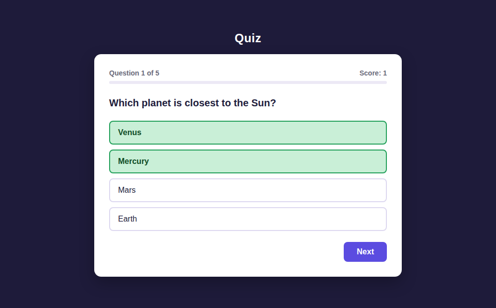
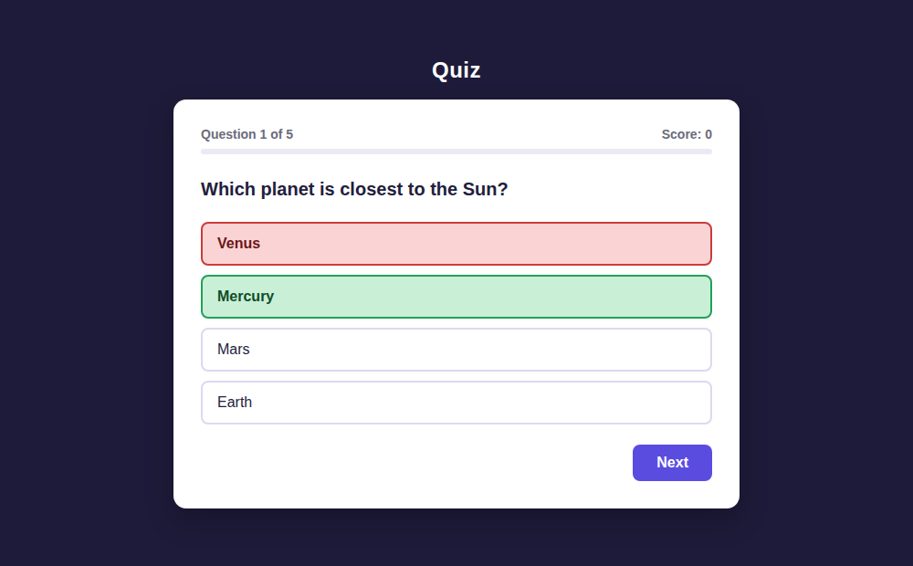
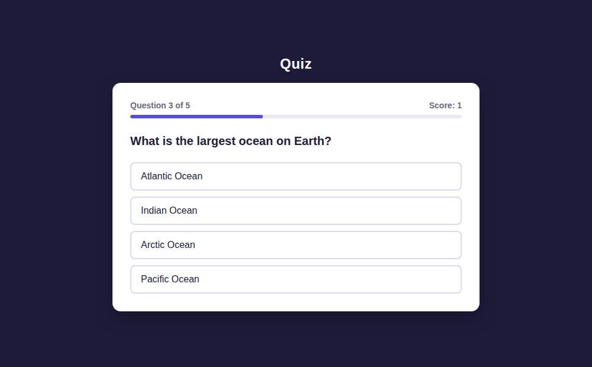
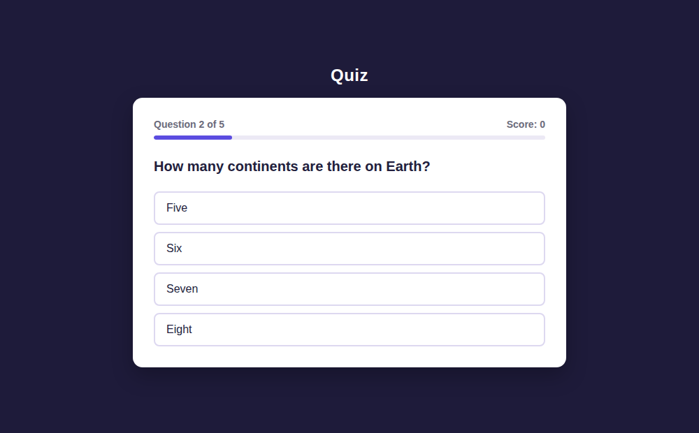
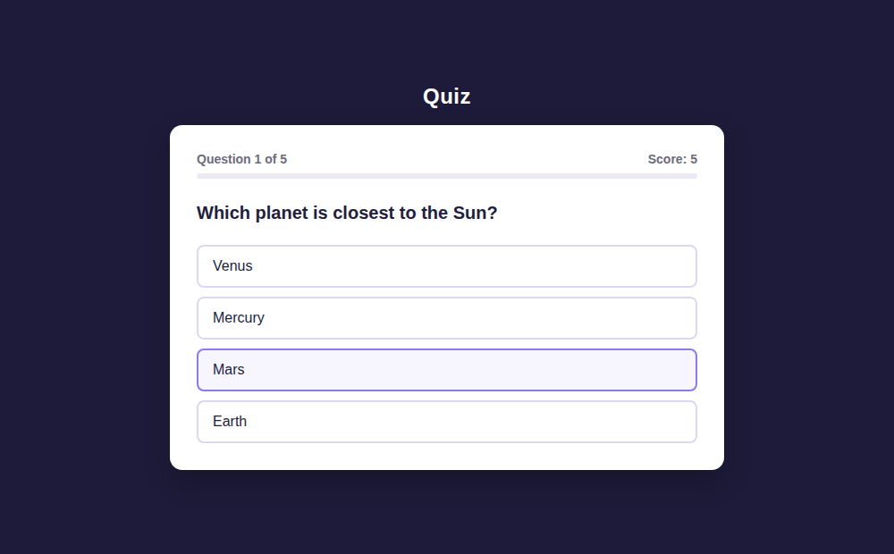
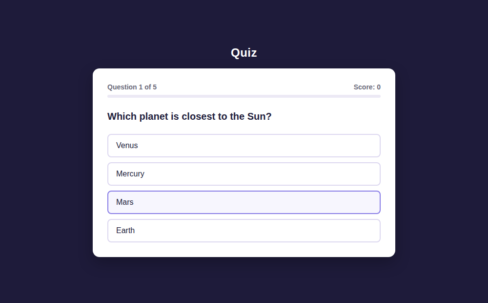

# The three bugs, fixed one commit at a time

You asked to see the process rather than just the finished file, so this repo
*is* the process. The first commit is a quiz app with all three of your bugs
still in it, written the way the usual tutorial writes it. Each commit after
that fixes exactly one bug and nothing else, so every diff is three or four
lines and you can read them in order.

| # | Commit | What changed |
|---|--------|--------------|
| 0 | [`2b9fe38`](../../commit/2b9fe38) | Starting point — all three bugs present |
| 1 | [`181b0be`](../../commit/181b0be) | Score no longer goes up on wrong answers |
| 2 | [`92fcf9c`](../../commit/92fcf9c) | No more skipped question, counter reads correctly |
| 3 | [`2535085`](../../commit/2535085) | Restart resets the score to zero |
| 4 | [`eeb88f9`](../../commit/eeb88f9) | Extra: a double-click can't score the same question twice |

Click any commit and GitHub shows you the red/green diff for that one fix.

To run the broken version yourself and watch it misbehave:

```
git clone https://github.com/anirudhatalmale6-alt/js-quiz-bugfix-walkthrough
cd js-quiz-bugfix-walkthrough
git checkout 2b9fe38
```

Then open `index.html`. `git checkout main` puts you back on the fixed one.

---

## Bug 1 — the score goes up on wrong answers

I clicked **Venus**, which is wrong.

| Before | After |
|---|---|
|  |  |

Before the fix, the wrong answer I picked is painted **green** and the score
reads **1**. After it, my pick is red, the right answer is green, and the score
stays **0**.

### Why it happens

The tutorial stores the correct flag on the button as a data attribute:

```js
button.dataset.correct = answer.correct;
```

and then tests it like this:

```js
const isCorrect = selectedBtn.dataset.correct;
if (isCorrect) { score++; }
```

A data attribute can only hold **text**. So `answer.correct === false` is
written into the DOM as the *string* `"false"` — and in JavaScript every
non-empty string is truthy, `"false"` included. The `if` therefore passes on
every answer, and the score climbs no matter what you click. That is also why
the wrong button turns green: the same `if` decides the colour.

You can see it for yourself in the browser console:

```js
Boolean("false")   // true
Boolean("")        // false
```

### The fix ([`181b0be`](../../commit/181b0be))

```diff
-  const isCorrect = selectedBtn.dataset.correct;
+  const isCorrect = selectedBtn.dataset.correct === "true";
```

One line. Comparing against the string is what turns it into a real test.

A stricter alternative, if you'd rather not round-trip through the DOM at all,
is to hand the answer object straight to the click handler so the value stays a
real boolean — that's what my other repo (`js-quiz-app-clean`) does. Both are
correct; the one-liner above is the smaller change to your existing file.

---

## Bug 2 — a question gets skipped and the counter is wrong

Both screenshots are taken after answering question 1 and pressing **Next** once.

| Before | After |
|---|---|
|  |  |

Before: it jumps straight to **Question 3 of 5**. Question 2 never appears.
After: **Question 2 of 5**, as it should be.

### Why it happens

`currentQuestionIndex++` was in **two** places — once at the end of the answer
handler, once at the top of the Next handler:

```js
function selectAnswer(e) {
  ...
  currentQuestionIndex++;        // <-- here
}

function handleNextButton() {
  currentQuestionIndex++;        // <-- and here
  ...
}
```

Answering a question bumps it once, pressing Next bumps it again, so the index
moves by two. The quiz shows questions 1, 3, 5 and then finishes — three
questions out of five. The counter isn't really a separate bug: it prints
`currentQuestionIndex + 1`, so it's telling you the truth about a variable
that's already wrong.

### The fix ([`92fcf9c`](../../commit/92fcf9c))

Delete the increment from `selectAnswer`. `handleNextButton()` is now the only
function in the file that touches `currentQuestionIndex`.

That's the rule worth keeping: **one variable, one place that changes it.** If
you ever find yourself writing `someIndex++` in a second function, that's the
moment the skipping starts.

---

## Bug 3 — Restart doesn't reset the score

Both screenshots are taken straight after finishing a run with **5 / 5** and
pressing **Play again**.

| Before | After |
|---|---|
|  |  |

Before: the new game opens on question 1 already showing **Score: 5**.
After: **Score: 0**.

### Why it happens

```js
let score = 0;      // this line runs ONCE, when the page loads
```

`startQuiz()` reset `currentQuestionIndex` but never touched `score`, so the
points survived into the next game. Nothing "remembers" the old score
deliberately — it was simply never cleared.

### The fix ([`2535085`](../../commit/2535085))

```diff
 function startQuiz() {
   currentQuestionIndex = 0;
+  score = 0;
   quizFinished = false;
   nextButton.innerHTML = "Next";
   showQuestion();
 }
```

The reason this is the right place: `startQuiz()` is the single entry point for
both the first run and Restart. Anything that needs to be fresh at the start of
a game belongs in that one function, so there's no second path that can forget
one of them.

---

## Extra — double-click ([`eeb88f9`](../../commit/eeb88f9))

Not on your list, but it was there: clicking an answer twice quickly ran the
handler twice and scored the same question twice. An `answered` flag at the top
of `selectAnswer` stops it.

---

## Applying the same three fixes to your own file

If you'd rather patch your file than switch to this one, search `script.js` for:

1. `dataset.correct` — wherever it's used in an `if`, add `=== "true"`.
2. `currentQuestionIndex++` (or whatever yours is called) — if it appears more
   than once, delete every occurrence except the one in the Next handler.
3. Your restart function — make sure `score = 0` is in it, not only at the top
   of the file.

That's the whole job. If any of those three don't look like your code, paste
the relevant function in the chat and I'll tell you exactly what to change.
